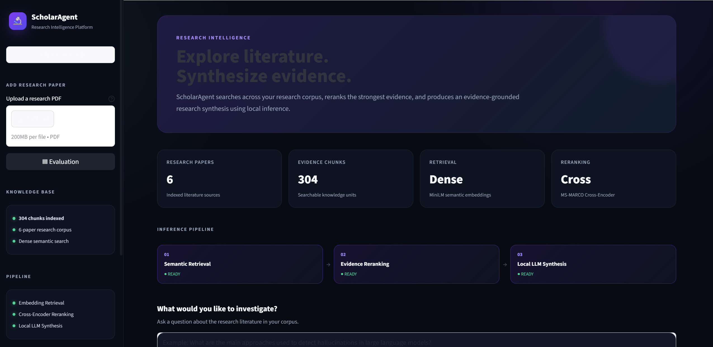
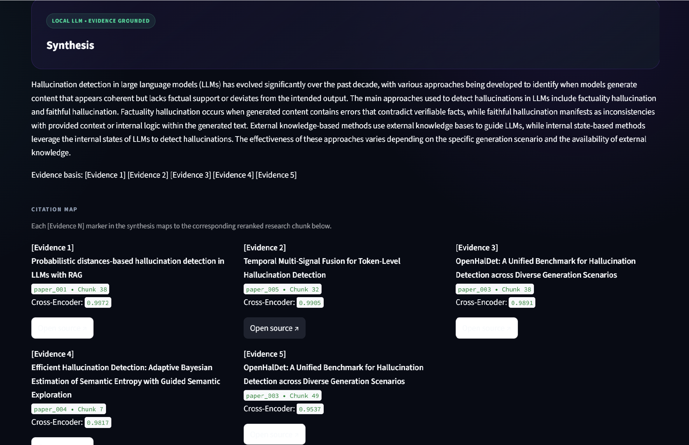
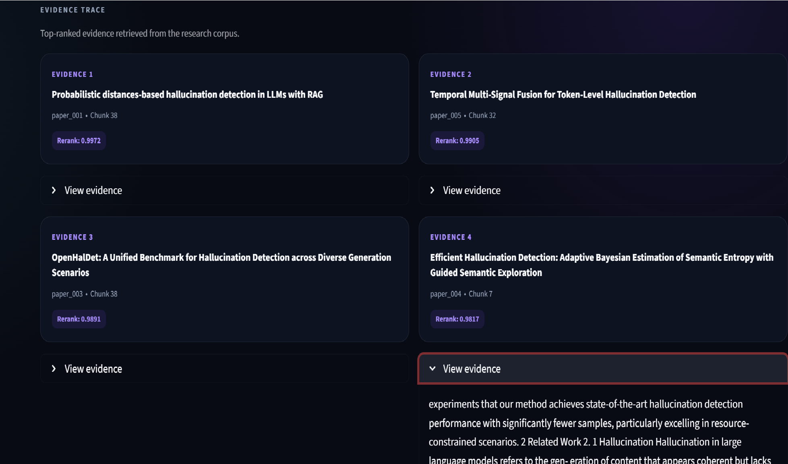
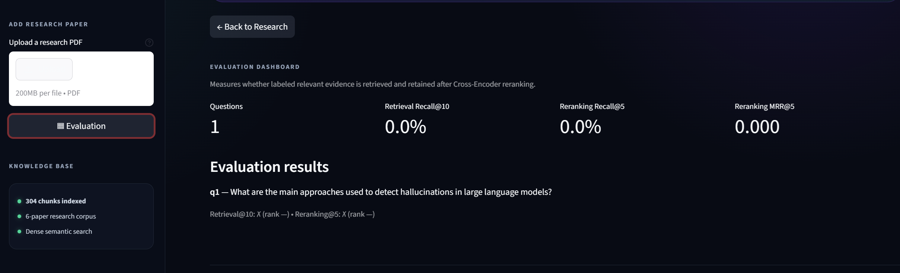

# ScholarAgent — Evidence-Grounded Research Intelligence Platform

> A multi-paper research assistant that retrieves relevant scientific evidence, reranks it using a Cross-Encoder, and generates grounded research syntheses using a local LLM.

---

## Overview

ScholarAgent is an evidence-grounded research assistant designed to help researchers work across multiple academic papers without relying solely on conventional keyword search or unrestricted language-model generation.

The system follows a retrieval-first architecture:

```text
Research Question
       ↓
Semantic Retrieval
       ↓
Candidate Evidence
       ↓
Cross-Encoder Reranking
       ↓
Top-Ranked Evidence
       ↓
Evidence-Aware Prompt
       ↓
Local LLM
       ↓
Grounded Research Synthesis
```

Instead of asking a language model to generate an answer from its internal knowledge alone, ScholarAgent first identifies relevant evidence from an indexed research corpus and then uses that evidence as the basis for synthesis.

This makes the generated response more traceable, inspectable, and suitable for research-oriented workflows.

---

## Key Features

### 1. Multi-Paper Research

ScholarAgent can work across multiple academic papers within a single indexed research corpus.

The current demonstration corpus contains:

- **6 research papers**
- **304 indexed chunks**
- Semantic retrieval across the indexed corpus
- Evidence-level retrieval and ranking

---

### 2. Semantic Retrieval

Research questions are converted into dense vector representations and compared against indexed paper chunks.

The system uses semantic similarity rather than relying only on exact keyword matches.

This allows conceptually related passages to be retrieved even when the wording differs between the query and the source material.

---

### 3. Cross-Encoder Reranking

Initial semantic retrieval produces a candidate evidence set.

ScholarAgent then applies a Cross-Encoder reranker to score the relationship between:

```text
Research Question ↔ Retrieved Evidence
```

This second-stage ranking improves evidence selection by evaluating the query and candidate passage together.

The pipeline therefore follows:

```text
Fast Retrieval
      ↓
Candidate Evidence
      ↓
Cross-Encoder
      ↓
Higher-Quality Evidence Ranking
```

---

### 4. Evidence-Grounded Local LLM Synthesis

The final answer is generated using a local LLM pipeline.

The model receives the selected evidence rather than being asked to answer the research question independently.

The synthesis stage is designed around the principle:

> Retrieve evidence first → rank evidence → synthesize from evidence.

---

### 5. Evidence Traceability

Each generated answer can be traced back to the evidence used to produce it.

The application exposes:

- Evidence IDs
- Paper IDs
- Chunk IDs
- Retrieval information
- Cross-Encoder scores
- Citation mappings
- Evidence cards

This allows users to inspect the basis of the generated synthesis instead of treating the response as an unexplained model output.

---

### 6. Citation Mapping

ScholarAgent maintains a mapping between generated evidence references and the underlying paper/chunk sources.

For example:

```text
[Evidence 1]
       ↓
Paper 002
       ↓
Chunk 017
```

This provides a transparent connection between the generated response and the retrieved research material.

---

### 7. PDF Ingestion and Indexing

The project includes a PDF ingestion pipeline for adding research papers to the corpus.

The pipeline supports:

```text
PDF
 ↓
Text Extraction
 ↓
Chunking
 ↓
Embedding Generation
 ↓
Indexed Research Corpus
```

The Streamlit interface also provides an upload/index workflow.

Duplicate indexing is prevented when a paper is already present in the corpus.

---

### 8. Evaluation Framework

ScholarAgent includes an evaluation pipeline for measuring retrieval and reranking quality.

The evaluation framework supports:

- Recall@10
- Reranking Recall@5
- Mean Reciprocal Rank (MRR)
- Question-level evaluation
- Ground-truth evidence labels

The repository includes:

```text
multipaper/
├── evaluation_questions.json
├── evaluation_labels.json
├── evaluation_results.json
└── evaluate.py
```

The evaluation dataset and labels are maintained separately from the retrieval implementation so that the system can be tested independently.

> **Evaluation note:** Reported metrics depend on the currently available ground-truth labels. The repository contains the evaluation framework and question set, while the labeled subset determines the currently computed scores.

---

# System Architecture

```text
                         ┌─────────────────────┐
                         │    Researcher       │
                         │  Research Question  │
                         └──────────┬──────────┘
                                    │
                                    ▼
                         ┌─────────────────────┐
                         │ Semantic Retrieval  │
                         │ Dense Embeddings    │
                         └──────────┬──────────┘
                                    │
                                    ▼
                         ┌─────────────────────┐
                         │ Candidate Evidence  │
                         └──────────┬──────────┘
                                    │
                                    ▼
                         ┌─────────────────────┐
                         │ Cross-Encoder       │
                         │ Reranking           │
                         └──────────┬──────────┘
                                    │
                                    ▼
                         ┌─────────────────────┐
                         │ Top-Ranked Evidence │
                         └──────────┬──────────┘
                                    │
                                    ▼
                         ┌─────────────────────┐
                         │ Evidence-Aware      │
                         │ Prompt Construction │
                         └──────────┬──────────┘
                                    │
                                    ▼
                         ┌─────────────────────┐
                         │ Local LLM           │
                         │ Synthesis           │
                         └──────────┬──────────┘
                                    │
                                    ▼
                         ┌─────────────────────┐
                         │ Research Synthesis  │
                         │ + Citations         │
                         │ + Evidence Trace    │
                         └─────────────────────┘
```

---

# Research Pipeline

## Stage 1 — Paper Ingestion

Academic PDFs are processed and converted into structured text.

```text
Research Paper PDF
       ↓
Text Extraction
       ↓
Document Cleaning
       ↓
Chunk Generation
```

---

## Stage 2 — Embedding Generation

Each text chunk is converted into a dense vector representation.

The semantic retrieval component uses:

```text
Sentence Transformers
all-MiniLM-L6-v2
```

These embeddings are stored in the indexed research corpus.

---

## Stage 3 — Semantic Retrieval

A research question is embedded using the same semantic representation.

The system compares the query representation with indexed chunks and retrieves the most semantically relevant candidates.

---

## Stage 4 — Cross-Encoder Reranking

Retrieved candidates are passed through a Cross-Encoder.

The reranker evaluates:

```text
(Query, Candidate Passage)
```

rather than independently encoding them.

The project uses:

```text
cross-encoder/ms-marco-MiniLM-L6-v2
```

for the reranking stage.

---

## Stage 5 — Evidence Selection

The highest-scoring evidence passages are selected for synthesis.

The application exposes the selected evidence through its evidence trace interface.

---

## Stage 6 — Local LLM Synthesis

The selected evidence is inserted into an evidence-aware prompt.

The local language model then produces a research-oriented synthesis based on the retrieved material.

The system is designed to keep the generation stage downstream of retrieval rather than allowing unrestricted generation.

---

# Technology Stack

| Component | Technology |
|---|---|
| Programming Language | Python |
| Frontend | Streamlit |
| Semantic Embeddings | Sentence Transformers |
| Embedding Model | all-MiniLM-L6-v2 |
| Reranking | Cross-Encoder |
| Reranker Model | ms-marco-MiniLM-L6-v2 |
| Machine Learning | PyTorch / Transformers |
| Text Processing | Python / PDF extraction |
| Evaluation | Scikit-learn / custom evaluation pipeline |
| LLM Inference | Local LLM |
| Version Control | Git / GitHub |

---

# Project Structure

```text
ScholarAgent/
│
├── app.py
│
├── main.py
│
├── pdf_ingest.py
│
├── README.md
├── requirements.txt
├── .gitignore
├── LICENSE
├── CONTRIBUTING.md
│
├── embeddings/
│
├── llm/
│   ├── synthesizer.py
│   └── scholar_agent.py
│
├── multipaper/
│   ├── multi_retriever.py
│   ├── multi_reranker.py
│   ├── evaluate.py
│   ├── evaluation_questions.json
│   ├── evaluation_labels.json
│   └── evaluation_results.json
│
├── retrieval/
│   ├── __init__.py
│   └── paper_search.py
│
└── papers/
    ├── corpus/
    ├── downloader.py
    ├── extractor.py
    ├── embed_chunks.py
    ├── evidence_retriever.py
    ├── reranker.py
    └── multi_paper_embeddings.json
```

---

# Installation

## 1. Clone the repository

```bash
git clone https://github.com/swethaburra2005-commits/ScholarAgent.git
cd ScholarAgent
```

---

## 2. Create a virtual environment

### Windows

```powershell
python -m venv venv
```

Activate it:

```powershell
venv\Scripts\activate
```

### macOS / Linux

```bash
python3 -m venv venv
source venv/bin/activate
```

---

## 3. Install dependencies

```bash
pip install -r requirements.txt
```

---

# Running the Application

Start the Streamlit application:

```bash
python -m streamlit run app.py
```

The application will open in the browser.

---

# Using ScholarAgent

## Step 1 — Enter a Research Question

Example:

```text
How does retrieval augmentation improve the factual reliability of language models?
```

---

## Step 2 — Retrieve Evidence

ScholarAgent performs semantic retrieval across the indexed research corpus.

---

## Step 3 — Rerank Evidence

Candidate passages are reranked using the Cross-Encoder.

---

## Step 4 — Generate Synthesis

The local LLM receives the highest-ranked evidence and generates a research-oriented synthesis.

---

## Step 5 — Inspect Evidence

The Evidence Trace section allows the researcher to inspect:

- Source paper
- Chunk ID
- Evidence ID
- Relevance score
- Citation mapping

---

# Evaluation

ScholarAgent evaluates the retrieval pipeline using research questions with associated ground-truth evidence.

### Retrieval Recall@10

Measures whether relevant ground-truth evidence appears within the top 10 retrieved candidates.

```text
Recall@10 =
Relevant questions with evidence in Top-10
-------------------------------------------
Total evaluated questions
```

---

### Reranking Recall@5

Measures whether relevant evidence remains within the top 5 positions after Cross-Encoder reranking.

---

### Mean Reciprocal Rank

MRR measures how highly the first relevant evidence appears in the ranking.

```text
MRR = average(1 / rank_of_first_relevant_result)
```

---

# Design Principles

## Evidence First

The system retrieves evidence before generation.

---

## Transparent Reasoning

The application exposes the evidence supporting the final synthesis.

---

## Modular Architecture

Retrieval, reranking, evaluation, ingestion, and generation are implemented as separate components.

---

## Local Inference

The synthesis pipeline is designed around local model inference rather than requiring an external proprietary API.

---

## Reproducibility

The project stores the retrieval corpus, evaluation configuration, and implementation components required to reproduce the demonstrated workflow.

---

# Application Interface

The Streamlit interface provides:

### Research Dashboard

Displays corpus information and provides the primary research query interface.

### Synthesis

Displays the generated research answer.

### Evidence Basis

Shows the evidence supporting the synthesis.

### Citation Map

Maps generated evidence references to source material.

### Evidence Trace

Provides detailed paper/chunk-level information and relevance scores.

### Evaluation Dashboard

Displays retrieval and reranking evaluation metrics.

### Paper Upload & Indexing

Allows additional research papers to be incorporated into the corpus.

---

# Screenshots

Screenshots of the application can be added to:

```text
screenshots/
```

Recommended screenshots:

```text
screenshots/
├── dashboard.png
├── synthesis.png
├── evidence-trace.png
└── evaluation.png
```

Example:

```markdown
## Research Dashboard



## Evidence-Grounded Synthesis



## Evidence Trace



## Evaluation Dashboard


```

---

# Research Contribution

ScholarAgent demonstrates a modular research-assistant architecture combining:

1. Multi-document retrieval
2. Dense semantic representations
3. Cross-Encoder relevance modeling
4. Evidence-aware prompt construction
5. Local LLM synthesis
6. Citation traceability
7. Retrieval evaluation

The primary design objective is to separate:

```text
Information Retrieval
        ↓
Evidence Ranking
        ↓
Language Generation
```

This separation makes the system easier to evaluate and inspect than a generation-only research assistant.

---

# Limitations

The current system has several limitations:

- Retrieval quality depends on the indexed corpus.
- The quality of generated synthesis depends on the selected evidence.
- Evaluation quality depends on the completeness of ground-truth labels.
- Local LLM performance depends on the selected model and available hardware.
- The current corpus is a demonstration research collection rather than a universal academic database.
- Citation traceability is based on retrieved chunks and does not replace manual verification of original papers.

---

# Future Enhancements

Potential extensions include:

- Larger academic corpora
- Hybrid BM25 + dense retrieval
- Query expansion
- Multi-query retrieval
- Improved citation verification
- Automatic contradiction detection
- Claim-level citation alignment
- Better hallucination detection
- Research-paper metadata extraction
- Author and venue filtering
- Temporal literature analysis
- Knowledge graph integration
- Persistent vector databases
- Advanced evaluation datasets
- Comparative LLM evaluation
- Agentic literature review workflows

---

# Security and Privacy

This repository intentionally excludes sensitive and unnecessary local artifacts.

Do not commit:

- API keys
- Passwords
- `.env` files
- Private credentials
- Private research documents
- Local virtual environments
- Model caches
- Private datasets

Research PDFs are kept outside the public Git repository through the `.gitignore` configuration.

---

# Reproducibility

The recommended environment is:

```text
Python 3.x
Windows / macOS / Linux
```

Install the dependencies using:

```bash
pip install -r requirements.txt
```

Then run:

```bash
python -m streamlit run app.py
```

---

# Project Status

**Current status: Functional prototype**

The current implementation includes:

- Multi-paper corpus
- PDF ingestion
- Chunking
- Semantic retrieval
- Cross-Encoder reranking
- Local LLM synthesis
- Evidence traceability
- Citation mapping
- Evaluation framework
- Streamlit research interface

---

# Academic / Portfolio Context

ScholarAgent was developed as a research-oriented software project exploring the intersection of:

- Information Retrieval
- Natural Language Processing
- Retrieval-Augmented Generation
- Semantic Search
- Transformer Models
- Cross-Encoder Ranking
- Large Language Models
- Research Automation
- Evaluation of Retrieval Systems

The project emphasizes both system implementation and research transparency.

---

# Author

**Swetha Burra**

Computer Science Engineering

GitHub:

https://github.com/swethaburra2005-commits

---

# License

This project is intended for educational and research purposes.

See the `LICENSE` file for details.   